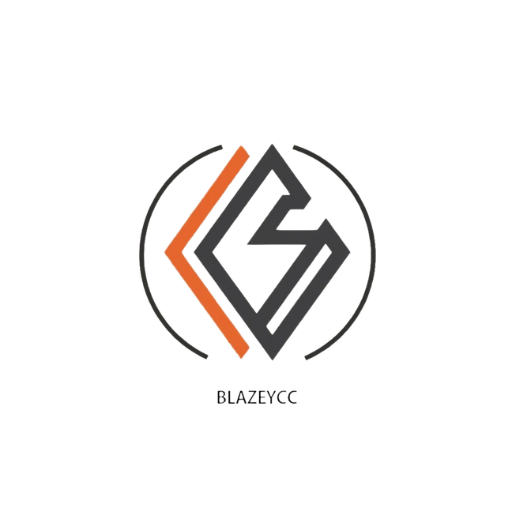

<p align="center">
  
</p>
<p align="center">
  <strong>Record any website as video</strong><br>
  Capture demos, tutorials, and presentations as high-quality MP4, WebM, or GIF
</p>

<p align="center">
  <a href="https://github.com/blazeycc/Blazeycc/releases/latest"></a>
  <a href="LICENSE"></a>
  
</p>

---

## Download

| Windows | Linux |
|--------|-------|
| [Blazeycc.exe](https://github.com/blazeycc/Blazeycc/releases/latest/download/Blazeycc.exe) | [AppImage](https://github.com/blazeycc/Blazeycc/releases/latest/download/Blazeycc.AppImage) |
| [Portable](https://github.com/blazeycc/Blazeycc/releases/latest/download/Blazeycc-Portable.exe) | [.deb](https://github.com/blazeycc/Blazeycc/releases/latest/download/Blazeycc.deb) |
| | [.rpm](https://github.com/blazeycc/Blazeycc/releases/latest/download/Blazeycc.rpm) |

---

## Features

- Record any URL as video (MP4, WebM, GIF)
- 23 social media presets (YouTube, TikTok, Twitter, etc.)
- Auto-scroll recording
- Batch recording (multiple URLs)
- Scheduled recordings
- 4K export (3840×2160)
- Custom watermarks
- Screenshot capture
- Bookmarks & history
- Dark & light themes
- Auto-updates

---

## Quick Start

1. Download the app
2. Enter a URL and click "Go"
3. Click Record to start capturing
4. Export as MP4, WebM, or GIF

---

## Development

```bash
# Install
npm install

# Run
npm start

# Build
npm run build:win    # Windows
npm run build:linux  # Linux
```

### Tech Stack

- Electron 40
- FFmpeg (video encoding)
- MediaRecorder API (webview capture)

---

## License

GPL-3.0 — see [LICENSE](LICENSE)